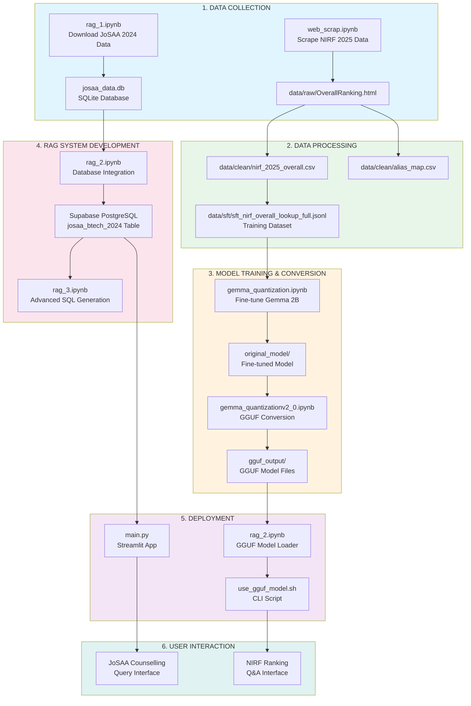
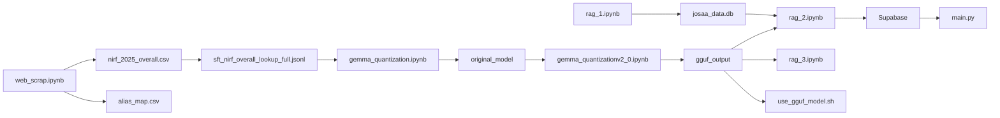

# Complete Project Flow - JoSAA AI Assistant + NIRF Model Workspace

## Project Overview

This repository contains a dual-purpose AI system:
1. **JoSAA AI Assistant** ([`main.py`](main.py:1)) - A Streamlit-based chatbot that answers JoSAA (Joint Seat Allocation Authority) counselling queries using PostgreSQL database
2. **NIRF Ranking Model** - A fine-tuned Gemma 2B model for NIRF (National Institutional Ranking Framework) 2025 institutional ranking lookups

---

## Complete Workflow Diagram



---

## Detailed Component Flow

### Phase 1: Data Collection

| Notebook/File | Purpose | Output |
|--------------|---------|--------|
| [`web_scrap.ipynb`](web_scrap.ipynb:1) | Scrapes NIRF 2025 rankings from official nirfindia.org | `data/raw/OverallRanking.html`, `data/clean/nirf_2025_overall.csv` |
| [`rag_1.ipynb`](rag_1.ipynb:1) | Downloads JoSAA 2024 counselling data from GitHub | `josaa_data.db` (SQLite with `josaa_2024` table) |

**Key Data Sources:**
- NIRF 2025: https://www.nirfindia.org/Rankings/2025/OverallRanking.html
- JoSAA 2024: https://github.com/sickboydroid/JoSAA-DataSet

---

### Phase 2: Data Processing

| Notebook | Purpose | Key Operations |
|----------|---------|----------------|
| [`web_scrap.ipynb`](web_scrap.ipynb:1) | Parse HTML tables, clean data, create normalized CSV | Uses `pandas.read_html()` and `BeautifulSoup` |
| [`rag_1.ipynb`](rag_1.ipynb:1) | Analyze JoSAA data structure, create training datasets | Generates `data/sft/sft_nirf_aishe.jsonl` |

**Data Files Created:**
- [`data/clean/nirf_2025_overall.csv`](data/clean/nirf_2025_overall.csv:1) - Cleaned NIRF rankings
- [`data/clean/alias_map.csv`](data/clean/alias_map.csv:1) - Institute name aliases
- [`data/sft/sft_nirf_overall_lookup_full_fixed.jsonl`](data/sft/sft_nirf_overall_lookup_full_fixed.jsonl:1) - SFT training data

---

### Phase 3: Model Training & Conversion

| Notebook | Purpose | Key Steps |
|----------|---------|-----------|
| [`gemma_quantization.ipynb`](gemma_quantization.ipynb:1) | Fine-tune Gemma 2B on NIRF data | Download base model → QLoRA fine-tuning → Save adapter |
| [`gemma_quantizationv2_0.ipynb`](gemma_quantizationv2_0.ipynb:1) | Convert to GGUF format | Clone llama.cpp → Convert to GGUF → Quantize |

**Model Pipeline:**
```
Base Model: google/gemma-2-2b-it
    ↓
Fine-tuned: coderop12/gemma2b-nirf-lookup-2025
    ↓
GGUF Converted: gemma2b-nirf-lookup-f16.gguf
    ↓
Quantized: gemma2b-nirf-lookup-q4_k_m.gguf (1.59 GB)
```

---

### Phase 4: RAG System Development

| Notebook | Purpose | Key Features |
|----------|---------|--------------|
| [`rag_1.ipynb`](rag_1.ipynb:1) | Data exploration and schema analysis | JoSAA data structure, field mapping |
| [`rag_2.ipynb`](rag_2.ipynb:1) | Full RAG with PostgreSQL + GGUF | SQL generation, database integration, model inference |
| [`rag_3.ipynb`](rag_3.ipynb:1) | Optimized GGUF loader | HuggingFace Hub download, CLI interface |

**RAG Architecture:**
```
User Query
    ↓
Query Enhancer (Gemini Flash)
    ↓
SQL Generator (Gemini 2.5 Pro)
    ↓
PostgreSQL Database (josaa_btech_2024)
    ↓
Answer Generator (Gemini Flash)
    ↓
Formatted Response
```

---

### Phase 5: Deployment

| File | Purpose | Technology |
|------|---------|------------|
| [`main.py`](main.py:1) | Production Streamlit app | Streamlit + PostgreSQL + Gemini API |
| [`use_gguf_model.sh`](use_gguf_model.sh:1) | CLI script for GGUF model | llama.cpp |
| [`rag_2.ipynb`](rag_2.ipynb:1) | Interactive notebook demo | llama-cpp-python |

**Main Application Components ([`main.py`](main.py:1)):**

1. **Database Layer** ([`Pg`](main.py:155) class): PostgreSQL connection pool
2. **Query Enhancer** ([`QueryEnhancer`](main.py:224) class): Gemini Flash for query rewriting
3. **SQL Generator** ([`SqlGenPro`](main.py:271) class): Gemini 2.5 Pro for SQL generation
4. **Answer Generator** ([`Answerer`](main.py:388) class): Natural language responses
5. **Pipeline Orchestrator** ([`Pipeline`](main.py:500) class): End-to-end workflow

---

## Execution Order for New Users

### To Run the Complete Pipeline:

1. **Data Collection** (Run first)
   ```bash
   # Run web_scrap.ipynb - Scrapes NIRF 2025 data
   # Run rag_1.ipynb - Downloads JoSAA 2024 data
   ```

2. **Model Training** (Optional - for retraining)
   ```bash
   # Run gemma_quantization.ipynb - Fine-tunes Gemma 2B
   # Run gemma_quantizationv2_0.ipynb - Converts to GGUF
   ```

3. **RAG Development** (For database setup)
   ```bash
   # Run rag_2.ipynb - Sets up PostgreSQL + tests GGUF model
   # Run rag_3.ipynb - Optimized model loading
   ```

4. **Production Deployment** (Final application)
   ```bash
   # Run main.py - Streamlit JoSAA Assistant
   streamlit run main.py
   ```

---

## Data Flow Summary

```
External Sources:
├── NIRF Website (nirfindia.org) → web_scrap.ipynb → data/clean/nirf_2025_overall.csv
└── JoSAA GitHub (sickboydroid/JoSAA-DataSet) → rag_1.ipynb → josaa_data.db

Processed Data:
├── NIRF CSV → SFT Dataset → Gemma Fine-tuning → GGUF Model
└── JoSAA DB → PostgreSQL → RAG System → main.py

Final Outputs:
├── main.py (Streamlit App for JoSAA Counselling)
└── use_gguf_model.sh (CLI for NIRF Ranking Q&A)
```

---

## Key Technologies Used

| Component | Technology |
|-----------|------------|
| Web Scraping | `requests`, `BeautifulSoup`, `pandas` |
| Database | `SQLite` (local), `PostgreSQL` (production), `psycopg2` |
| LLM Fine-tuning | `transformers`, `peft` (QLoRA), `trl` |
| Model Conversion | `llama.cpp`, `convert_hf_to_gguf.py` |
| Inference | `llama-cpp-python`, `google-generativeai` |
| Web App | `streamlit` |
| Data Processing | `pandas`, `numpy`, `json` |

---

## File Dependencies



---

## Next Steps for Development

1. **Data Updates**: Re-run `web_scrap.ipynb` when NIRF 2026 is released
2. **Model Retraining**: Re-run `gemma_quantization.ipynb` with new data
3. **Database Migration**: Use `rag_2.ipynb` to sync JoSAA 2025 data when available
4. **App Enhancement**: Modify [`main.py`](main.py:1) to add new features to the Streamlit interface

---

## Notes

- The JoSAA AI Assistant ([`main.py`](main.py:1)) requires PostgreSQL credentials (configured via environment variables)
- The NIRF GGUF model can run locally without GPU using llama.cpp
- All notebooks are designed to be run independently for specific tasks
- The complete pipeline from data collection to deployment is modular and reproducible
